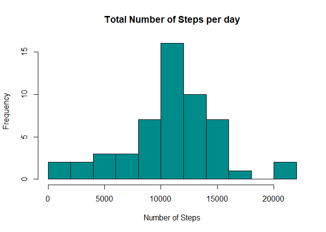
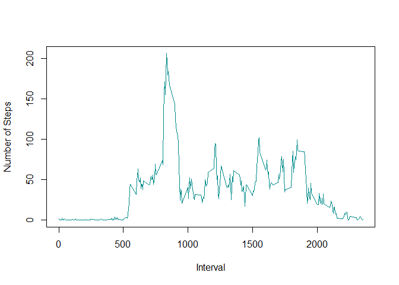
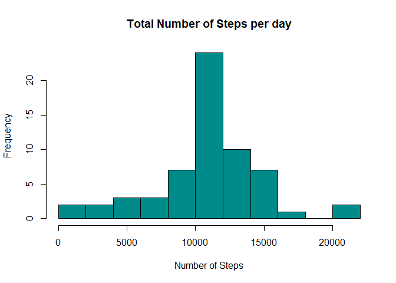
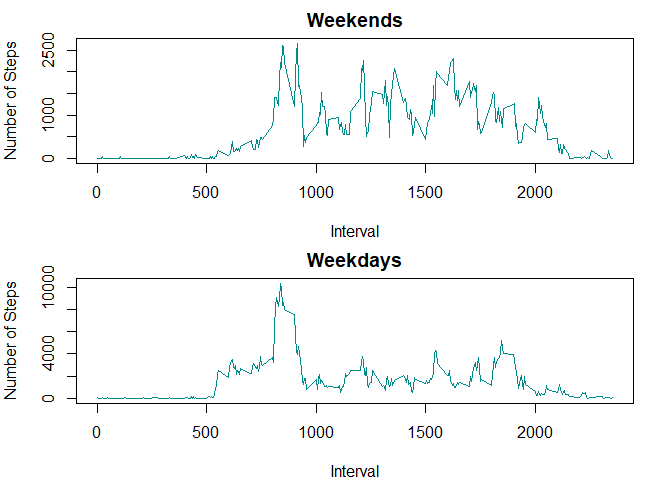

Reproducible Research: Course Project 1
================
June 24th, 2021

<br> <br>

## Loading and preprocessing the data

``` r
data_activity <- read.csv(file = "activity.csv", header = TRUE)
```

<br> <br>

## What is mean total number of steps taken per day?

  - Remove NAs from data:

<!-- end list -->

``` r
processed_data <- data_activity[complete.cases(data_activity),] 
```

<br>

  - Format dates to date format

<!-- end list -->

``` r
processed_data$date <- as.Date(processed_data$date)
na_data <- data_activity[is.na(data_activity$steps),]
```

<br>

  - Create new dataset with the sum of steps per
day

<!-- end list -->

``` r
sum_steps <- aggregate(processed_data["steps"], by = processed_data["date"], sum)
```

<br>

  - Create Histogram of Number of Steps per
day

<!-- end list -->

``` r
hist(sum_steps$steps, col = "blue", main = "Total Number of Steps per day", breaks = 10, 
     xlab = "Number of Steps", ylab = "Frequency")
```

<!-- --> <br>

  - Calculate Mean and Median

<!-- end list -->

``` r
mean_steps <- mean(sum_steps$steps)
median_steps <- median(sum_steps$steps)
```

The mean is 1.076618910^{4}. <br>The median is 10765. <br>

## Average daily activity pattern

  - Create new dataset with the mean average steps per
interval

<!-- end list -->

``` r
avg_steps <- aggregate(processed_data["steps"], by = processed_data["interval"], mean)
```

<br>

  - Create Time Series
Plot

<!-- end list -->

``` r
plot(steps ~ interval, data = avg_steps, type = "l", col = "blue", xlab = "Interval", ylab = "Number of Steps")
```

<!-- --> <br>

  - Check Maximum number of steps and which interval

<!-- end list -->

``` r
max_steps <- max(avg_steps$steps)
max_interval <- subset(avg_steps, steps == max_steps)
```

<br>

The Maximum Number of steps is 206.1698113. <br>The Maximum Number of
steps happened on the 835th interval. <br> <br>

## Imputing missing values

  - Total number of missing values in the dataset

<!-- end list -->

``` r
total_missing_values <- sum(is.na(data_activity$steps))
```

There are 2304 in the dataset. <br>

  - Substitute the missing values with the mean of that
day

<!-- end list -->

``` r
mean_steps <- with(processed_data, tapply(steps, processed_data$interval, mean))
na_data$steps <- mean_steps
new_data <- rbind(processed_data, na_data)
new_data <- new_data[order(new_data$date), ]
```

<br>

  - Histogram

<!-- end list -->

``` r
total_steps <- with(new_data, tapply(steps, as.factor(new_data$date), sum))
hist(total_steps, col = "blue", main = "Total Number of Steps per day", breaks = 10, 
     xlab = "Number of Steps", ylab = "Frequency")
```

<!-- --> <br>

  - Calculate Mean and Median

<!-- end list -->

``` r
mean_steps2 <- mean(total_steps)
median_steps2 <- median(total_steps)
```

The mean is 1.076618910^{4}. <br>The median is 1.076618910^{4}. <br>

### Differences in activity patterns between Weekdays and Weekends

  - Check if days are weekends or weekdays

<!-- end list -->

``` r
new_data$date <- as.Date(new_data$date)
new_data$weekdays <- weekdays(new_data$date, abbreviate = FALSE)
```

<br>

  - Time Series
Plot

<!-- end list -->

``` r
weekends_data <- subset(new_data, weekdays == "Saturday" | weekdays == "Sunday")
total_weekend_steps <- aggregate(weekends_data["steps"], by = weekends_data["interval"], sum)
weekdays_data <- subset(new_data, weekdays == "Monday" | weekdays == "Tuesday" | weekdays == "Wednesday" | weekdays == "Thursday" | weekdays == "Friday")
total_weekdays_steps <- aggregate(weekdays_data["steps"], by = weekdays_data["interval"], sum)
par(mfcol = c(2, 1))
par(mar = c(4, 4, 2, 2))
plot(steps ~ interval, data = total_weekend_steps, type = "l", col = "blue", main = "Weekends", xlab = "Interval", ylab = "Number of Steps")
plot(steps ~ interval, data = total_weekdays_steps, type = "l", col = "blue", main = "Weekdays", xlab = "Interval", ylab = "Number of Steps")
```

<!-- -->
